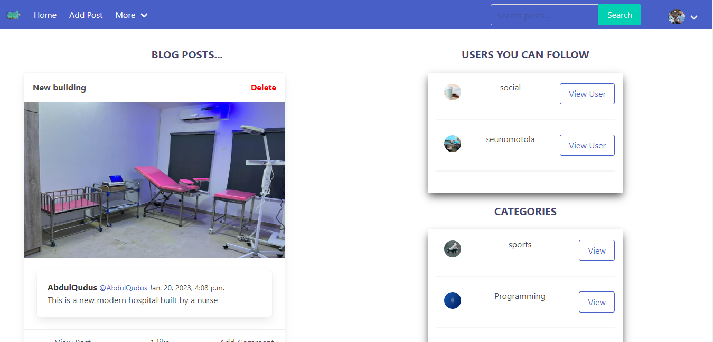

# django-blog-app

full stack CRUD blog website built with HTML, Bulma CSS, and Django framework. <br />


## Table of contents

- [Overview](#overview)
  - [The challenge](#the-challenge)
  - [Screenshot](#screenshot)
  - [Links](#links)
- [My process](#my-process)
  - [Built with](#built-with)
  - [What I learned](#what-i-learned)
  - [Useful resources](#useful-resources)
- [To use](#usage)

## Overview

### The challenge

Users should be able to:

- Add a post.
- View each post.
- Add comments to the post and like a post.
- Follow and unfollow users.
- View post categories.
- Login as a user and log out.
- Update and delete posts.
- Search for posts.
- View the optimal layout for the site depending on their device's screen size

### Screenshot




### Links

- Solution URL: (https://github.com/faozziyyah/django-blog-app)
- Live link: (not yet available)

## My process

### Built with

- HTML
- Bulma - CSS framework
- Django

### What I learned

- Django authentication and authorization
- How to use the Django Admin
- pagination
- Adding Images

```Python
def like_post(request):
    username = request.user.username
    post_id = request.GET.get('post_id')

    post = Post.objects.get(id=post_id)

    like_filter = LikePost.objects.filter(post_id=post_id, username=username).first()

    if like_filter == None:
        new_like = LikePost.objects.create(post_id=post_id, username=username)
        new_like.save()
        post.no_of_likes = post.no_of_likes+1
        post.save()
        return redirect('index')
    else:
        like_filter.delete()
        post.no_of_likes = post.no_of_likes-1
        post.save()
        return redirect('index')

```

```HTML
<div id="loginform">

        <h1 style="text-transform: uppercase; font-size: 25px; text-align: center; font-weight: bold; color: #46436d; margin-top: 1em;">Add Post </h1> <br />

        
    
        <h1 style="text-align:center; font-size: 20px; font-style:italic; margin-top: 1em;"> Your Post was submitted successfully!!!
            <br /> Waiting For Approval !!!
        </h1>
    
        
    
            <form action="" method="POST" enctype="multipart/form-data" style="width: 80%; margin: auto;">
                
                {{ form.as_p }} <br />
    
                <input type="submit" value="Add Post" class="button is-link" />
        
            </form>
    

    </div>

    

```

### Useful resources

- [Django](https://www.djangoproject.com/) - Django makes it easier to build better web apps more quickly and with less code. 
- [Bulma CSS](https://bulma.io/documentation/) - Django makes it easier to build better web apps more quickly and with less code.
